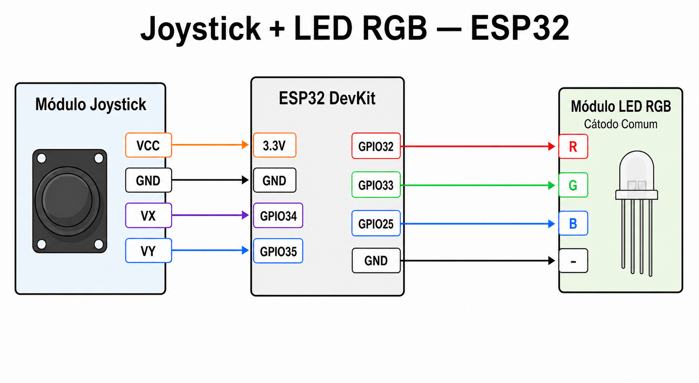

# ESP32 Joystick + RGB LED Demo

Projeto ESP-IDF que utiliza um joystick analógico para controlar a cor e a
intensidade de um módulo LED RGB conectado ao ESP32.

O eixo horizontal seleciona a cor no espectro HSV, enquanto o eixo vertical
controla o brilho. As saídas do LED são acionadas por PWM utilizando o
periférico LEDC do ESP32.

## Hardware

- ESP32
- Módulo joystick analógico
- Módulo LED RGB de cátodo comum
- Jumpers

### Ligações

| Componente | Pino do componente | Conexão         |
| ---------- | ------------------ | --------------- |
| Joystick   | VCC                | 3V3 do ESP32    |
| Joystick   | GND                | GND do ESP32    |
| Joystick   | VX                 | GPIO34 do ESP32 |
| Joystick   | VY                 | GPIO35 do ESP32 |
| LED RGB    | R                  | GPIO32 do ESP32 |
| LED RGB    | G                  | GPIO33 do ESP32 |
| LED RGB    | B                  | GPIO25 do ESP32 |
| LED RGB    | `-`                | GND do ESP32    |

> O joystick é alimentado com 3,3 V e todos os GNDs devem estar conectados em comum.



## Funcionamento

O joystick funciona como um controle de dois eixos. O movimento horizontal
percorre as diferentes cores disponíveis, enquanto o movimento vertical
aumenta ou diminui a intensidade do LED.

As leituras são suavizadas para evitar que pequenas oscilações alterem a cor
ou provoquem variações visíveis no brilho. O LED acompanha continuamente os
movimentos realizados no joystick.

## Compilar e gravar

Requer o ESP-IDF configurado no terminal.

```bash
idf.py set-target esp32
idf.py build
idf.py -p /dev/ttyUSB0 flash monitor
```

Substitua `/dev/ttyUSB0` pela porta serial da sua placa.
