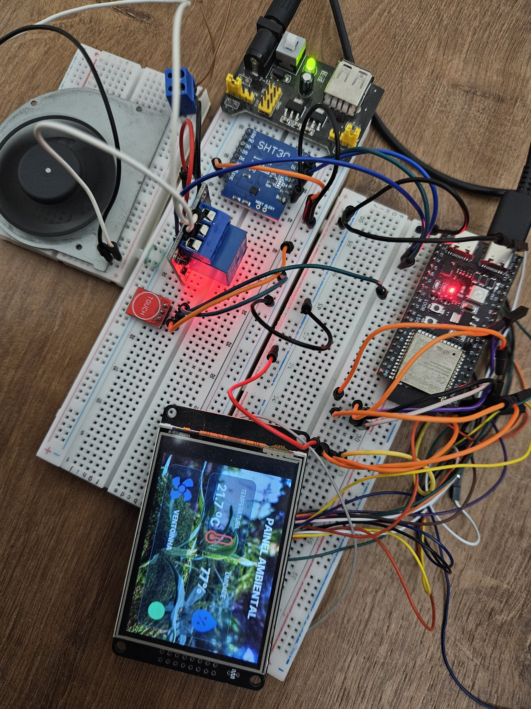
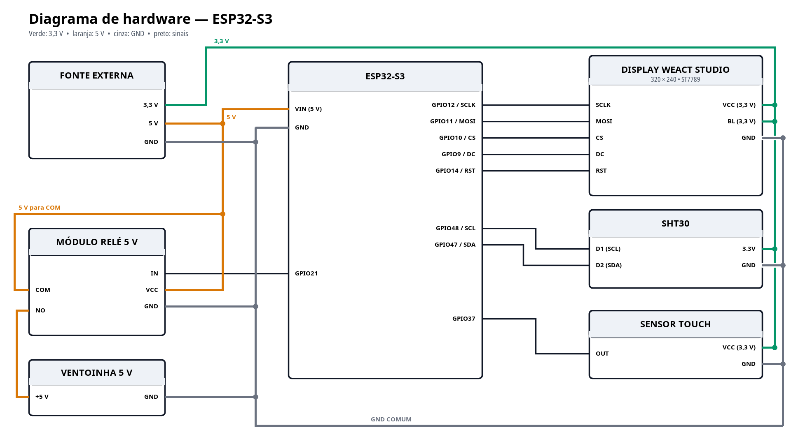
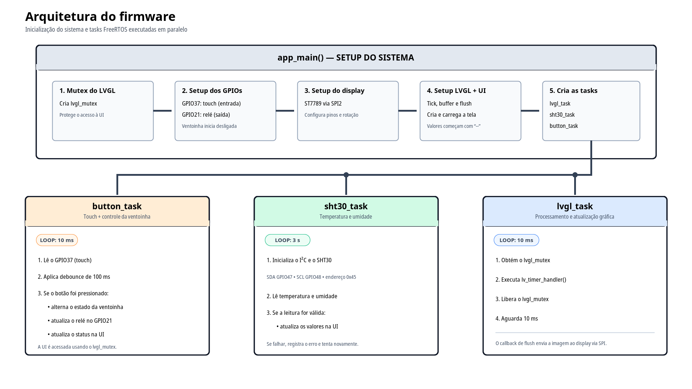

# ESP32 Climate Control

Painel de controle climático desenvolvido com **ESP32-S3** e **LVGL**. A interface gráfica foi desenhada no **Figma**, construída no **LVGL Pro** e exportada para o projeto ESP-IDF no **Visual Studio Code**. O sistema monitora temperatura e umidade com um sensor SHT30 e permite ligar ou desligar uma ventoinha por meio de um sensor touch e um módulo relé.

Mais do que uma demonstração de sensores, este projeto explora a construção de interfaces embarcadas bonitas e profissionais. O layout criado no Figma é transformado em componentes LVGL e integrado ao firmware, mostrando como um microcontrolador pode ser a base de painéis para automação, máquinas, equipamentos e sistemas de controle mais complexos.



## Funcionalidades

- leitura de temperatura e umidade relativa a cada 3 segundos;
- validação CRC dos dados recebidos do SHT30;
- dashboard gráfico em um display TFT de 320 × 240 pixels;
- interface com fontes, imagens, cards e indicador de estado personalizados;
- acionamento de uma ventoinha de 5 V por módulo relé;
- comando por sensor touch com debounce;
- atualização sincronizada da interface em tasks FreeRTOS independentes;
- driver SPI próprio para o controlador ST7789.

## Fluxo de desenvolvimento da interface

O desenvolvimento da interface seguiu este fluxo:

**Figma → LVGL Pro → exportação do código → VS Code + Espressif IDF → ESP32-S3**

1. **Design no Figma:** definição da hierarquia visual, do espaçamento, da tipografia, das cores e dos estados da interface.
2. **Construção no LVGL Pro:** o design foi levado para o LVGL Pro, onde a tela foi transformada em componentes compatíveis com LVGL, construída e validada.
3. **Geração e exportação:** o LVGL Pro gerou os arquivos C, fontes, imagens, componentes e definições da tela presentes em `components/ui`.
4. **Integração no VS Code:** o código exportado foi incorporado ao projeto ESP-IDF no Visual Studio Code, utilizando a extensão **Espressif IDF**. Nessa etapa foram implementados os drivers, as tasks FreeRTOS e a integração da interface com os sensores e atuadores.
5. **Execução no hardware:** o firmware é compilado, gravado e executado no ESP32-S3, que renderiza a interface no display por meio do LVGL.

Este repositório contém o **código-fonte do projeto exportado e integrado no ambiente ESP-IDF**. Os arquivos gerados da interface estão organizados como um componente independente em `components/ui`. Eles incluem a tela principal, componentes reutilizáveis, imagens e diferentes pesos da fonte Inter. O código da aplicação mantém a lógica de negócio separada da camada visual e atualiza somente os elementos dinâmicos:

- valor da temperatura;
- valor da umidade;
- indicador de estado da ventoinha.

Essa separação aproxima o projeto de uma arquitetura utilizada em produtos reais: o design pode evoluir sem misturar toda a interface com drivers, leitura de sensores e regras de controle.

## Hardware

- ESP32-S3;
- display WeAct Studio 320 × 240 com controlador ST7789;
- sensor de temperatura e umidade SHT30;
- sensor touch digital;
- módulo relé de 5 V;
- ventoinha de 5 V;
- fonte externa com saídas de 3,3 V e 5 V;
- protoboard e jumpers.

### Ligações

| Componente     | Pino do componente | Conexão no ESP32-S3 / alimentação |
| -------------- | ------------------ | --------------------------------- |
| Display ST7789 | SCLK               | GPIO12                            |
| Display ST7789 | MOSI               | GPIO11                            |
| Display ST7789 | CS                 | GPIO10                            |
| Display ST7789 | DC                 | GPIO9                             |
| Display ST7789 | RST                | GPIO14                            |
| Display ST7789 | VCC e BL           | 3,3 V                             |
| Display ST7789 | GND                | GND comum                         |
| SHT30          | D1 (SCL)           | GPIO48                            |
| SHT30          | D2 (SDA)           | GPIO47                            |
| SHT30          | 3.3V               | 3,3 V                             |
| SHT30          | GND                | GND comum                         |
| Sensor touch   | OUT                | GPIO37                            |
| Sensor touch   | VCC                | 3,3 V                             |
| Sensor touch   | GND                | GND comum                         |
| Módulo relé    | IN                 | GPIO21                            |
| Módulo relé    | VCC                | 5 V                               |
| Módulo relé    | GND                | GND comum                         |
| Módulo relé    | COM                | 5 V da fonte                      |
| Módulo relé    | NO                 | positivo da ventoinha             |
| Ventoinha      | GND                | GND comum                         |
| ESP32-S3       | VIN                | 5 V                               |
| ESP32-S3       | GND                | GND comum                         |

> Todos os GNDs devem estar interligados. Não alimente a ventoinha diretamente por um GPIO do ESP32; use o módulo relé e uma fonte adequada à corrente da carga. Confira também a pinagem do seu display, sensor e módulo relé, pois ela pode variar entre fabricantes.



## Funcionamento

Na inicialização, o firmware:

1. cria o mutex que protege o acesso ao LVGL;
2. configura o GPIO do sensor touch e a saída do relé, mantendo a ventoinha desligada;
3. inicializa o display ST7789 por SPI2, com clock de 80 MHz;
4. inicializa o LVGL em RGB565, cria a tela e carrega os recursos gráficos;
5. inicia as tasks responsáveis pela interface, pelo SHT30 e pelo botão touch.

Depois da inicialização, três fluxos são executados em paralelo:

- `lvgl_task`: processa a interface a cada 10 ms;
- `sht30_task`: lê temperatura e umidade a cada 3 segundos e atualiza o dashboard;
- `button_task`: monitora o touch a cada 10 ms, aplica debounce de 100 ms e alterna o relé e o indicador visual da ventoinha.

O display usa renderização parcial para reduzir o consumo de RAM. As atualizações feitas pelas diferentes tasks passam por um mutex, evitando acesso simultâneo aos objetos do LVGL.



## Tecnologias

- ESP-IDF 5.3.0;
- FreeRTOS;
- LVGL 9.5.0;
- Figma;
- LVGL Pro;
- Visual Studio Code com a extensão Espressif IDF;
- C e CMake;
- SPI e I²C.

O LVGL é obtido automaticamente pelo ESP-IDF Component Manager a partir do arquivo `main/idf_component.yml`.

## Compilar e gravar

É necessário ter o ESP-IDF instalado e configurado no terminal. O projeto está preparado para o alvo `esp32s3` e para flash de 16 MB.

```bash
idf.py set-target esp32s3
idf.py build
idf.py -p /dev/ttyUSB0 flash monitor
```

Substitua `/dev/ttyUSB0` pela porta serial da sua placa. Para sair do monitor, pressione `Ctrl+]`.

Com o sistema em execução, o monitor serial apresenta as leituras e as mudanças de estado da ventoinha:

```text
I (...) climate_control: SHT30 inicializado: SDA=47, SCL=48, endereco=0x45
I (...) climate_control: Temperatura: 25.60 C | Umidade: 58.40%
I (...) climate_control: Ventoinha ligada
```

## Organização do projeto

```text
.
├── components
│   └── ui
│       ├── components     # Componentes visuais gerados pelo LVGL Pro
│       ├── fonts          # Fontes Inter incorporadas ao firmware
│       ├── images         # Recursos gráficos convertidos para LVGL
│       └── screens        # Tela gerada do painel ambiental
├── docs
│   ├── hardware-block-diagram.png
│   ├── project.jpg
│   └── software-architecture-diagram.png
├── main
│   ├── main.c             # Inicialização, tasks e integração do sistema
│   ├── sht30.c/.h         # Driver do sensor SHT30
│   └── st7789.c/.h        # Driver do display ST7789
├── CMakeLists.txt
├── sdkconfig.defaults
└── README.md
```

## Personalização

Os pinos, os níveis ativos, os períodos de atualização e as dimensões do display estão definidos no início de `main/main.c`. Ajuste essas constantes se utilizar outra placa ou módulos com comportamento diferente.

O endereço I²C configurado para o SHT30 é `0x45`. Alguns módulos usam `0x44`; nesse caso, altere `SHT30_ADDRESS` antes de compilar.

Para modificar o visual, altere primeiro o design no Figma, atualize a interface no LVGL Pro e faça uma nova geração e exportação para `components/ui`. Evite editar manualmente os arquivos gerados, pois uma nova exportação do LVGL Pro pode sobrescrever essas alterações. A lógica específica da aplicação deve permanecer separada nos arquivos do firmware.
