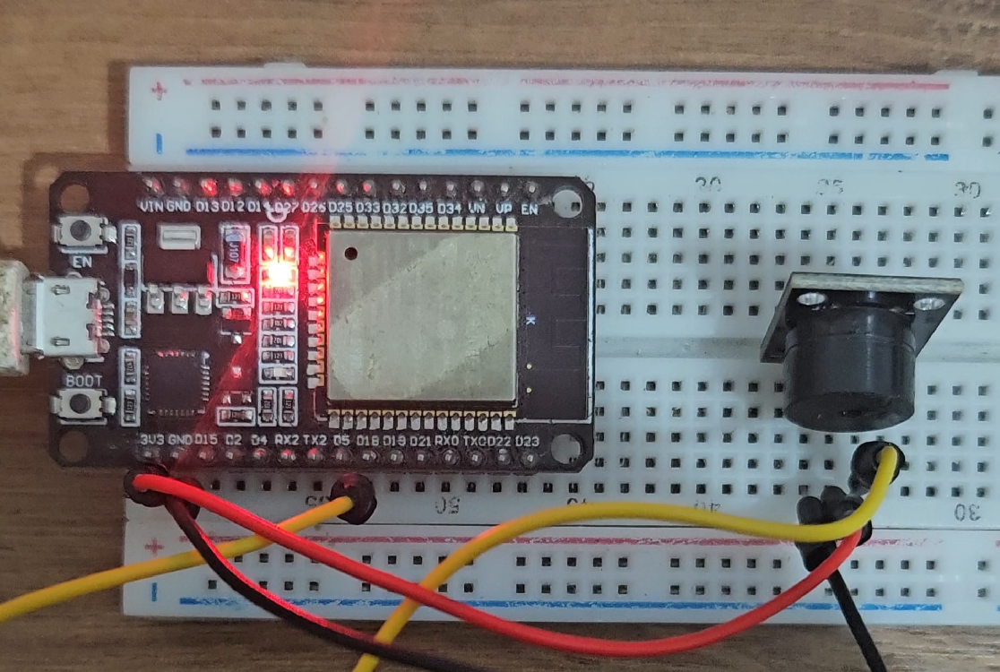
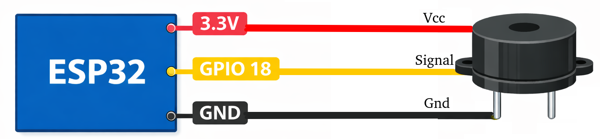

# Retro Buzzer

Projeto simples e nostálgico que reproduz o tema clássico do Super Mario Bros usando um ESP32 e apenas um buzzer passivo, programado em C com ESP-IDF.

Vídeo Youtube: [ESP32 tocando Super Mario com apenas um buzzer](https://www.youtube.com/watch?v=F0IVrVtifDo)

O som é gerado via PWM (LEDC), controlando a frequência para cada nota musical.

🧩 Componentes

- ESP32

- Buzzer passivo

🔌 Conexões

- GPIO 18 → Sinal do buzzer

- GND → GND do buzzer

- 3.3V → VCC do buzzer (se necessário)

### Software

- Vscode + ESP-IDF extension
- ESP-IDF v5.3.0
