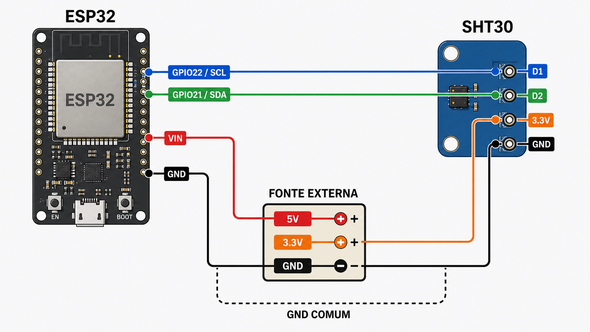

# ESP32 SHT30 Demo

Projeto ESP-IDF que realiza a aquisição periódica de temperatura e umidade relativa utilizando um sensor SHT30 conectado ao ESP32 pela interface I²C.

O firmware utiliza o driver genérico [libdriver/sht30](https://github.com/libdriver/sht30/), adaptado à API atual `driver/i2c_master.h` do ESP-IDF por meio de callbacks implementados no `main.c`. As medições são realizadas em modo single shot, com alta repetibilidade, e exibidas no monitor serial a cada 3 segundos.

## Hardware

- ESP32
- Módulo SHT30
- Fonte externa com saídas de 5 V e 3,3 V
- Jumpers

### Ligações

| Componente | Pino do componente | Conexão                |
| ---------- | ------------------ | ---------------------- |
| ESP32      | VIN                | 5 V da fonte externa   |
| ESP32      | GND                | GND da fonte externa   |
| SHT30      | 3.3V               | 3,3 V da fonte externa |
| SHT30      | GND                | GND da fonte externa   |
| SHT30      | D1 (SCL)           | GPIO22 do ESP32        |
| SHT30      | D2 (SDA)           | GPIO21 do ESP32        |

> Todos os GNDs devem estar conectados em comum. Confira a pinagem do seu módulo SHT30, pois a identificação e a ordem dos pinos podem variar entre fabricantes.



## Funcionamento

Durante a inicialização, a aplicação:

1. Registra no driver SHT30 os callbacks de I²C, atraso e log implementados para o ESP-IDF.
2. Cria o barramento I²C mestre com SDA no GPIO21, SCL no GPIO22 e frequência de 100 kHz.
3. Adiciona o sensor ao barramento utilizando o endereço `0x45`.
4. Inicializa o SHT30 e configura as medições com alta repetibilidade.

Após a inicialização, o firmware solicita uma nova medição de temperatura e umidade a cada 3 segundos. O driver valida o CRC, converte os valores brutos e a aplicação apresenta o resultado no terminal:

```text
I (361) sht30_demo: Temperature: 25.93 C | Humidity: 58.51 %
I (3381) sht30_demo: Temperature: 25.96 C | Humidity: 58.39 %
```

O endereço `0x45` corresponde ao pino ADDR do SHT30 conectado ao nível lógico alto. Para módulos configurados com ADDR em nível baixo, o endereço padrão é `0x44` e o código precisa ser ajustado para `SHT30_ADDRESS_0`.

## Como usar

1. Faça as conexões conforme a tabela ou o diagrama.
2. Configure o ambiente do ESP-IDF no terminal.
3. Compile e grave o firmware no ESP32.
4. Abra o monitor serial para acompanhar as medições.

## Compilar e gravar

Requer o ESP-IDF configurado no terminal.

```bash
idf.py build
idf.py -p /dev/ttyUSB0 flash monitor
```

Substitua `/dev/ttyUSB0` pela porta serial da sua placa.
