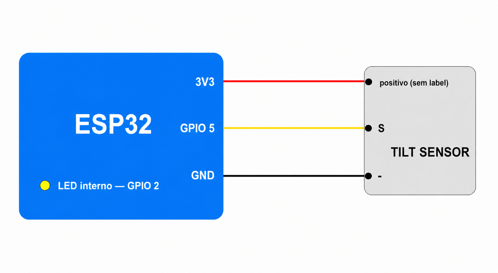

# ESP32 + Tilt Sensor

Demo simples utilizando um módulo tilt sensor e o LED integrado do ESP32.
Quando uma inclinação é detectada, o LED acende. O código utiliza debounce para
filtrar ruídos do contato mecânico do sensor.

## Ligação

O módulo é alimentado com 3,3 V do próprio ESP32.

| ESP32 | Tilt sensor |
| ----- | ----------- |
| 3V3 | Pino positivo sem label |
| GPIO 5 | `S` (sinal) |
| GND | `-` (negativo) |

O LED utilizado já está integrado à placa e é controlado pelo GPIO 2.



## Comportamento

- Sensor na posição normal: LED apagado.
- Inclinação detectada: LED aceso.
- A mudança precisa permanecer estável por 50 ms para ser aceita.

O firmware considera o sinal em nível baixo (`LOW`) como inclinação detectada.

## Compilar e gravar

```bash
idf.py set-target esp32
idf.py build
idf.py -p /dev/ttyUSB0 flash monitor
```

As configurações principais estão no início de `main/main.c`:

```c
#define LED_GPIO GPIO_NUM_2
#define TILT_SENSOR_GPIO GPIO_NUM_5
#define DEBOUNCE_TIME_MS 50
```
